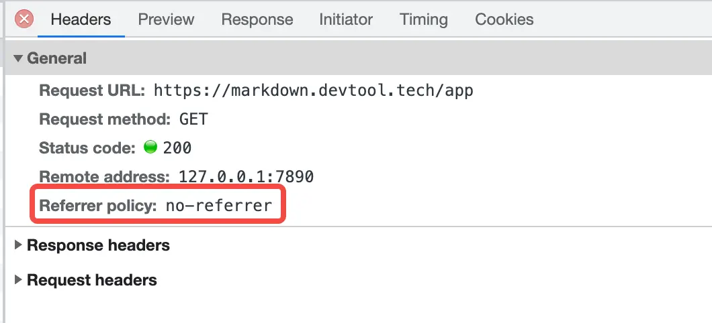

## Referer

> Referer 的正确拼法应该是 Referrer。

Referer 请求头指当前请求页面的来源地址。比如

1. 你在谷歌搜索页面进入掘金，那该掘金网页的 Referer 就是谷歌搜索页面
2. 你在知乎文章页面进入掘金，那该掘金网页的 Referer 就是知乎文章页面
3. 你直接在地址栏输入掘金，那该掘金网页的 Referer 请求头不存在

而对于 JS/CSS/Image 来说，Referer 字段一般是对应的文档页面，即 HTML 页面，因为它是通过 HTML 页面中的链接而发起的请求。

由于 `Referer` 可以拿到网站的来源页面，在打点服务中可以进行打点统计分析，取得本网站的来源网站的流量占比。如果是商业网站，则可以通过此信息分析流量投放。举一个最简单的例子，比如某网站每天有 1000 条请求是通过网站甲进来，则向网站甲每天支付 1000 元。

### 防盗链

    除了打点统计分析外，Referer 最大的功能是做图片防盗链。

试举一例，当你访问掘金的图片时，请求图片的请求头中的 Referer 将是图片所在的掘金文章地址。如果掘金服务器端，判断请求图片的请求头 Referer 并不是掘金的域名，则禁止访问，返回 403 状态码。

由于掘金图片可以任意上传，如果被人当做图床，这对于掘金来说是笔不少的服务器费用，因此才有了图片防盗链的技术。

### 防盗链示例

解决这种问题，除了图片防盗链，还有图片水印的方式，比如掘金就选择了后者。哔哩哔哩选择了图片防盗链，以哔哩哔哩首页轮播图及 curl 命令行为例说明：

**直接访问该图片地址，访问成功，从以下几点可以看出**

1. 200 状态码
2. content-type 为 image/png，证明是图片格式
3. content-length 为 2182486，2MB 左右大小，证明不可能是占位符图片
4. 最后下载提示你为二进制图片格式，需要下载到本地

**而添加一个其它域名的 Referer 去请求该图片，则直接返回 403 状态码，被防盗链**

```Bash

# 直接访问该图片地址，访问成功，从以下几点可以看出
➜ curl -i https://i0.hdslb.com/bfs/banner/728f45f115c9b99752bb162664600a183b23c8da.png
HTTP/2 200
date: Fri, 21 Oct 2022 09:27:55 GMT
content-type: image/png
content-length: 2182486
server: openresty
access-control-allow-credentials: true
access-control-allow-headers: Origin,No-Cache,X-Requested-With,If-Modified-Since,Pragma,Last-Modified,Cache-Control,Expires,Content-Type,Access-Control-Allow-Credentials,DNT,X-CustomHeader,Keep-Alive,User-Agent,X-Cache-Webcdn
access-control-allow-methods: GET, POST, OPTIONS
access-control-expose-headers: Content-Length,X-Cache-Webcdn
age: 878023
cache-control: max-age=31536000
code: 200
content-md5: PdwTJ7x/JqWVwLBUUwCIxg==
etag: 3ddc1327bc7f26a595c0b054530088c6
expires: Wed, 11 Oct 2023 09:28:24 GMT
last-modified: Mon, 10 Oct 2022 10:34:11 GMT
x-amz-request-id: 1665451704636109847
x-amz-version-id: v1.0.0
x-ccdn-cachettl: 31536000
x-edge-server-addr: 61.172.228.209
x-hash: /bfs/banner/728f45f115c9b99752bb162664600a183b23c8da.png
nginx-hit: 1
nginx-vary: Origin,Accept-Encoding
via: CHN-SH-CT8-CACHE17[12],CHN-SH-CT8-CACHE26[0,TCP_HIT,11],CHN-JSyangzhou-GLOBAL1-CACHE112[4],CHN-JSyangzhou-GLOBAL1-CACHE110[0,TCP_HIT,2]
x-hcs-proxy-type: 1
vary: Origin,Accept-Encoding
accept-ranges: bytes
access-control-allow-origin: *
x-cache-webcdn: HW
cross-origin-resource-policy: cross-origin

Warning: Binary output can mess up your terminal. Use "--output -" to tell
Warning: curl to output it to your terminal anyway, or consider "--output
Warning: <FILE>" to save to a file.


# 添加一个其它域名的 Referer 去请求该图片，则直接返回 403 状态码，防盗链
➜ curl -i -H "referer: https://shanyue.tech" https://i0.hdslb.com/bfs/banner/728f45f115c9b99752bb162664600a183b23c8da.png
HTTP/2 403
server: openresty
date: Fri, 21 Oct 2022 09:28:55 GMT
content-type: text/html
content-length: 150
via: CHN-SH-CT8-CACHE29[1]
access-control-allow-origin: *
x-cache-webcdn: HW
cross-origin-resource-policy: cross-origin
x-edge-server-addr: 61.172.228.209

<html>
<head><title>403 Forbidden</title></head>
<body>
<center><h1>403 Forbidden</h1></center>
<hr><center>openresty</center>
</body>
</html>
```

### 防防盗链

    那如何防止防盗链呢？

既然防盗链的原理是判断 `Referer` 请求头，那岂不是不发既可以了？

确实如此，并且浏览器可以通过 `Referrer-Policy` 响应头控制是否发送 `Referer` 请求头。

```Bash
# 不发送 referer 请求头
Referrer-Policy: no-referrer
```

也可以将它置于 HTML 中

```HTML
<meta name="referrer" content="origin" />
```

```HTML
<meta name="referrer" content="no-referrer" />
```

在月哥的工具网站 [MDTU](https://markdown.devtool.tech/app) 中便通过 no-referrer 策略来避免防盗链，你可以将某个防盗链的图片使用 Markdown 格式添加至该工具编辑器中，发现任何防盗链图片都可以正常显示。

