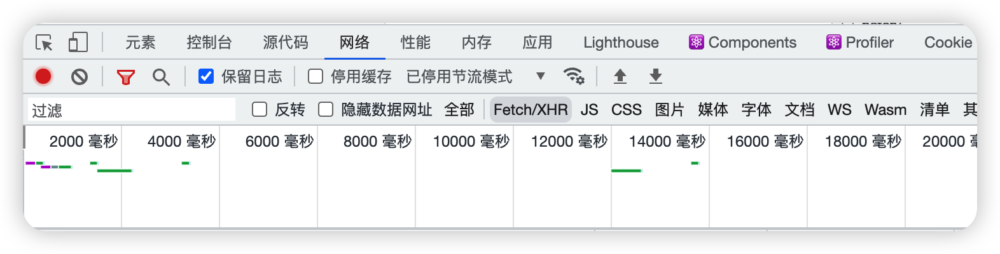
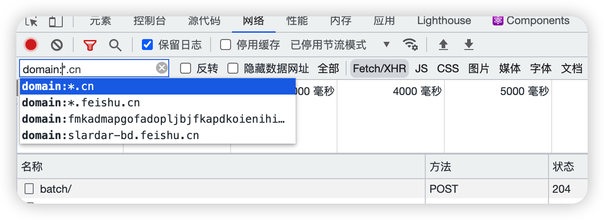
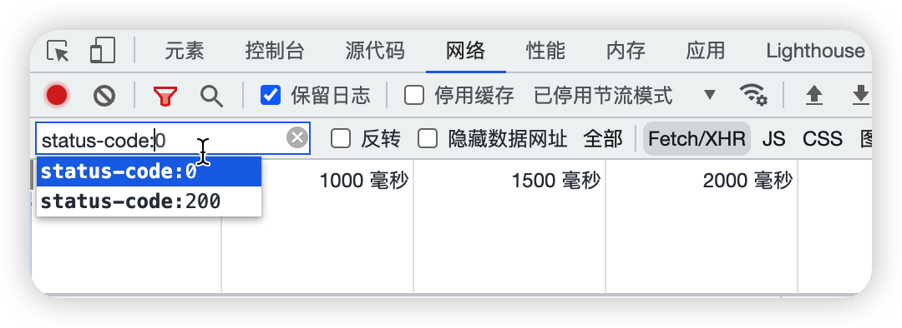

## Chome Devtools

    cmd + option + i (macos)打开控制台网络面板

[官方文档 Inspect network activity](https://developer.chrome.com/docs/devtools/network/#search)

### Header Options

在网络面板中,右键点击`Header Options`,可在网络面板中显示更多选项列。
建议添加以下选项

- Protocol：HTTP 协议版本号
- Content-Length：响应体大小
- Content-Encoding：响应体编码

### Filter

在筛选条的最左侧,有筛选文本输入框,可对资源进行筛选。

1. `/[cj]s/`,直接输入正则表达式对资源进行筛选
2. `domain:<domain>`,根据域名进行筛选
3. `method`:根据请求方法进行筛选
4. `status-code`:根据状态码进行筛选,**另它会自动补充所有资源的状态码，可查看该网站资源有多少状态码**
5. `larger-than:<size>`:筛选大于指定体积的资源,如 `larger-than:100k`
6. `has-response-header:<header>`,可对是否包含某响应头进行筛选,如 `has-response-header:cache-control`
7. `mime-type`:根据指定 MIME 类型进行筛选

### 底部状态栏

1. 打开网络面板控制台后,有 75 个请求
2. 打开网络面板控制台后,有 472kB 资源进行了传输,未压缩时体积为 2.8MB,压缩后为 472kB

在控制台中,也可以通过以上配置显示每条资源压缩前和解压后的体积。

Question:

1. 在开发环境调试 HTTP 请求时，如何只筛选出 localhost 上的所有请求
   Answer:
   使用 `domain:localhost`
2. 控制台左下角，transformed size 与 resource size 有何区别
   Answer:
   transformed 是传输资源(压缩后)的总大小
   resource 是加载资源(未压缩)的总大小
   一个是压缩后实际传输的大小,一个是未压缩时要传输的大小
3. 如何看出某个网站首页加载了多少个请求
   Answer:
   打开控制台网络面板,左下角的 requests 就是总共的请求数量
4. 如何在控制台中显示 HTTP 协议一列
   Answer:
   在控制台网络面板的右键请求,点击 Header options,勾选 Protocol 即可显示 Http 协议
