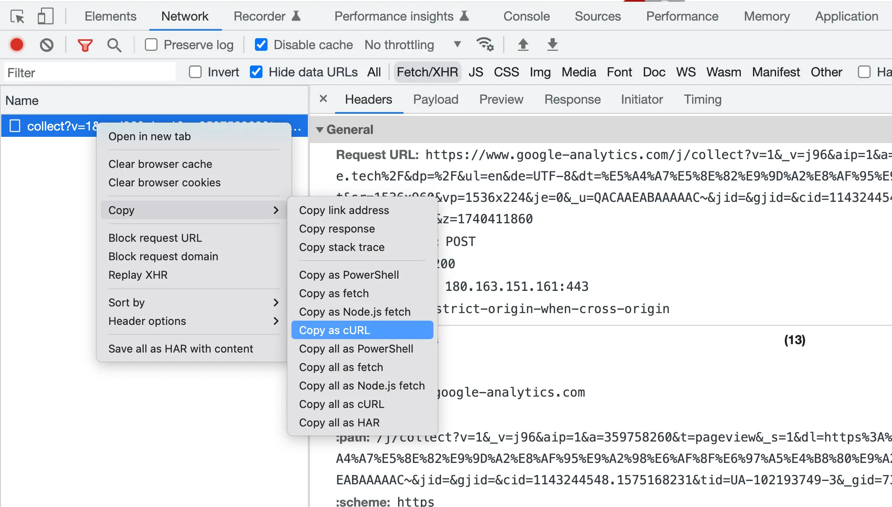

## curl

    curl，用于发送请求的命令行工具，一个 HTTP 请求客户端（实际上它也可以做 FTP/SCP/TELNET 协议的事情）。可类比于浏览器中的 fetch。

curl 是最为流行的 HTTP 请求命令行工具，在谷歌浏览器控制台的网络面板中，可将当前请求转化为 curl。


### curl 与常见选项

如果紧跟 URL，则直接发送 GET 请求。

```Bash
curl ifconfig.me
```

`https://ifconfig.me`是一个获取客户端公网 ip 的服务

除此之外，还有一些常见选项：

- -X/--request：指定请求方法
- -I/--head：发送 HEAD 请求
- -H/--header：指定请求头
- -d/--data：指定请求体

### curl --request

`--request/-X`,指定请求方法，如 `POST`/`GET` 等方法,默认为 `GET` 请求。

### curl --head

`--head/-I` 发送 HEAD 请求,只会返回 Response Header。

### curl --include

`--include/-i`,打印 Response Header 与 Response Body。

### curl --verbose

`--verbose/-v`,查看发送报文及 TLS handshake 的详细。
-v 是一级详情日志, -vv 是更详细,-vvv 更更详细
[TLS 握手](https://blog.csdn.net/chengqiuming/article/details/83115642)

### curl --location

`--location/-L`,追踪重定向。

```Bash
# 重定向两次后请求到数据
$ curl --location http://zhihu.com

# 可使用 --head，查看到三次响应
$ curl --head --location http://zhihu.com
```

### httpie && examples

    httpie 是现代化更为流行的一个 HTTP 客户端，支持色彩、JSON 等。

```Bash
# 发送 JSON 数据给服务器端，httpie 比 curl 方便很多，不需要自己手写 header，curl 默认为 application/x-www-form-urlencoded
$ http POST httpbin.org/post "a: 3" name=shanyue
$ curl -X POST httpbin.org/post -H "a: 3" -H "content-type: application/json" -d '{"name": "shanyue"}'

# 发送 Form 数据给服务器端，curl/httpie 都比较方便
$ http -f POST httpbin.org/post "a: 3" name=shanyue
$ curl -X POST httpbin.org/post -H "a: 3" -d name=shanyue

# 上传文件
$ http POST httpbin.org/post < Readme.md
$ curl -X POST httpbin.org/post -H "content-type: application/json" -d @Readme.md

# multipart 上传文件
$ http --multipart httpbin.org/post a=3 b@'Readme.md'
```

## Question:

1. curl/httpie 如何发送一个 GET 请求
   Answer:
   curl 地址(curl 默认请求方式为 GET)
   curl --request GET 地址

2. curl/httpie 如何发送 JSON 数据给服务器端
   Answer:
   curl --request POST httpbin.org/post --header "content-type:application/json" --data "{'age':'24'}"
3. curl/httpie 如何发送 FORM 数据给服务器端
   Answer:
   curl --request POST httpbin.org/post --data age=24(curl 默认的 content-type 就是 x-www-form-urlencoded)
   curl --request POST httpbin.org/post --header "content-type:application/x-www-form-urlencoded" --data age=24
4. curl/httpie 如何追踪重定向路径
   Answer:
   curl --location http://zhihu.com (获取的是最终重定向到的内容)
   curl --head --location http://zhihu.com (可以查看每次的重定向)
5. curl/httpie 如何仅返回 Response Header
   curl --head
