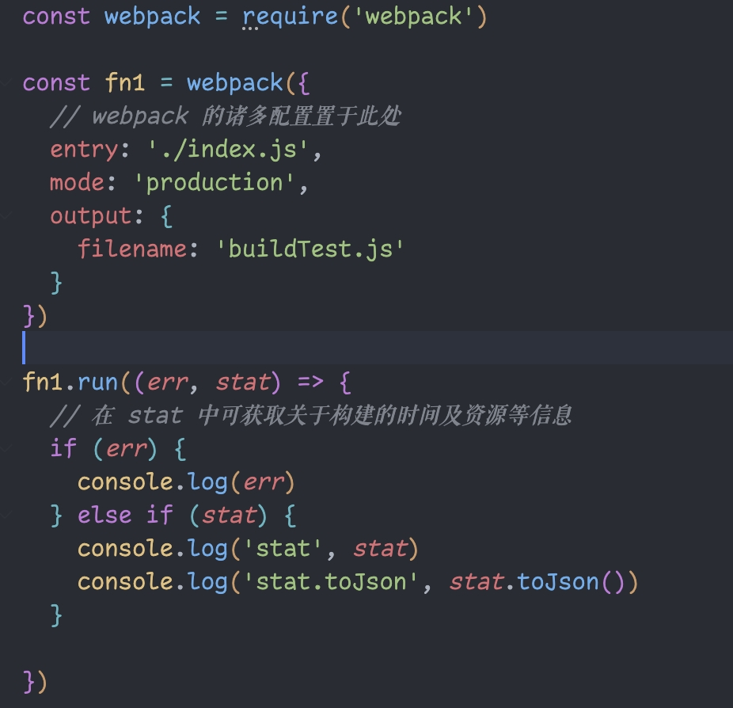
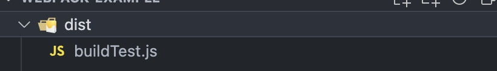
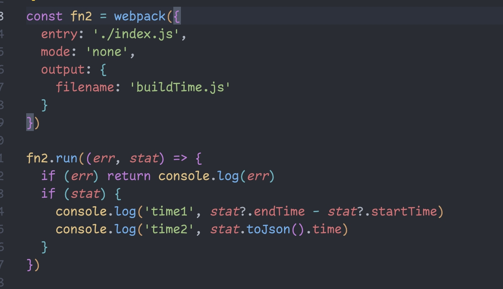
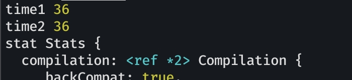
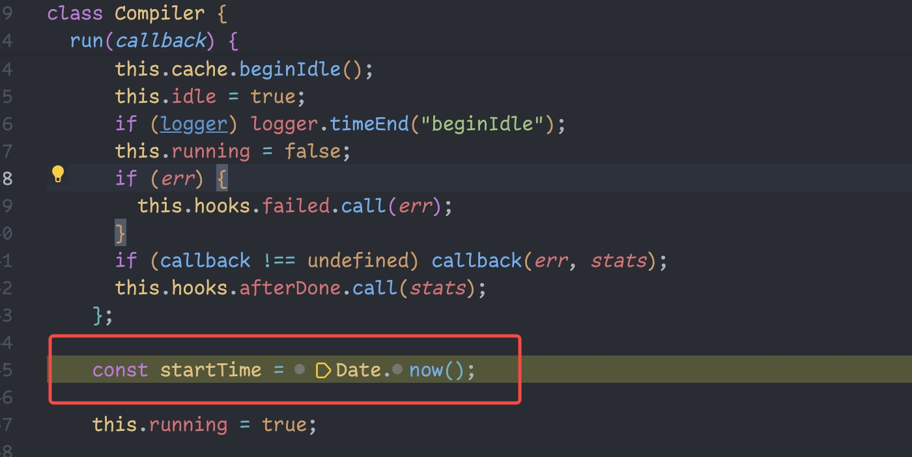
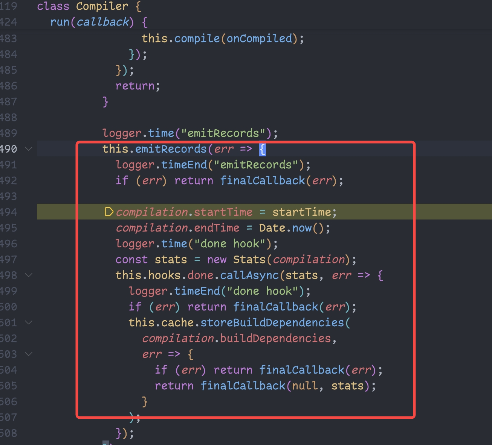
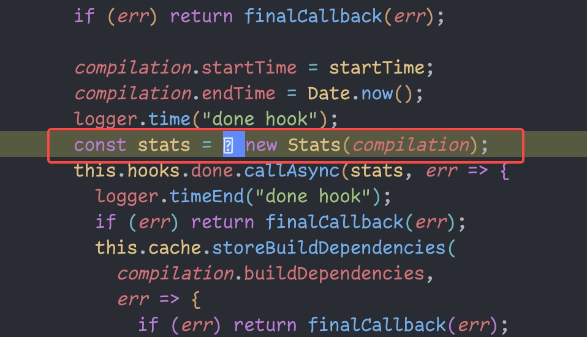
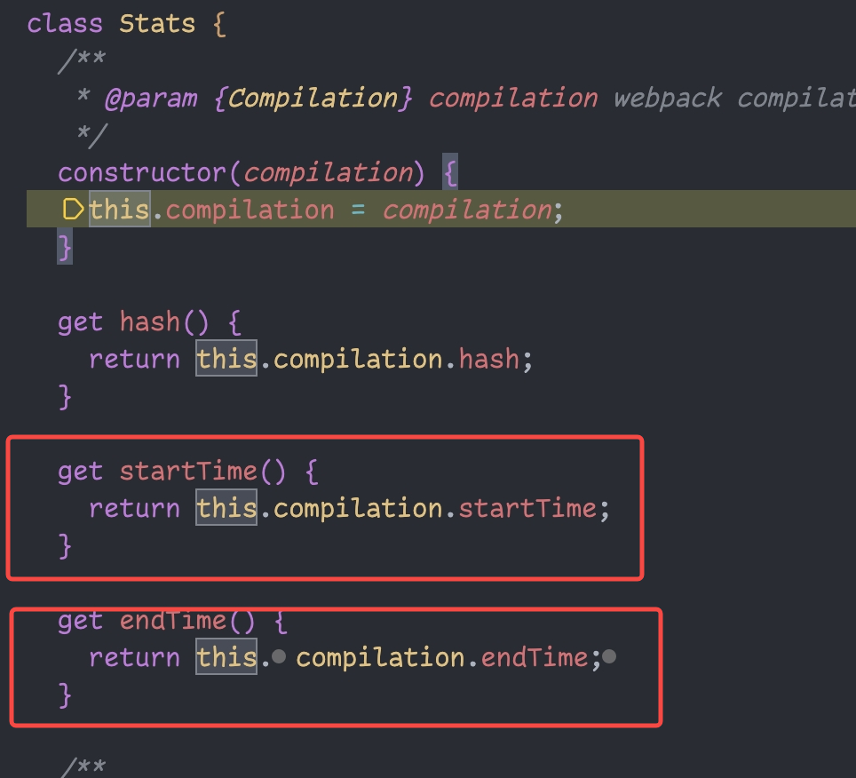
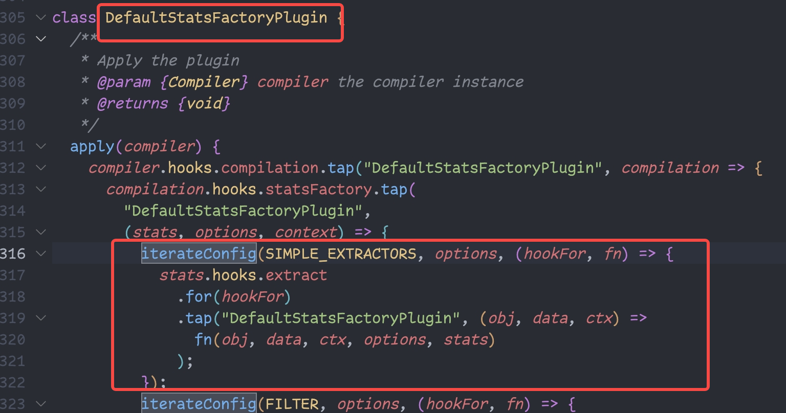
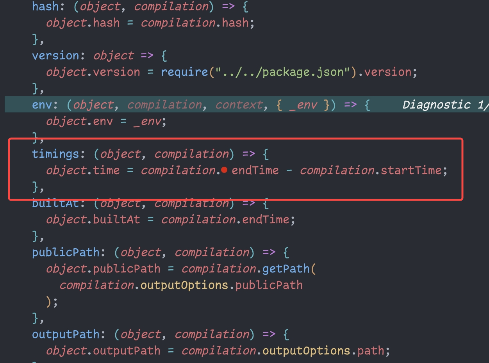

1.  使用 webpack api 打包一个最简的 js 资源

    
    执行 node build.js 得到
    

2.  如何计算每次 webpack 构建时间

    我们分别打印 stat 和 stat.toJson。会发现 stat 中有 startTime 和 endTime2 个时间戳，而 stat.toJson 中有 time 这个属性。
    
    我们执行这段代码
    
    会发现 stat 中的 endTime - startTime 和 stat.toJson() 中的 time 相等，这两个都是可以得知 webpack 的构建时间

3.  断点调试 webpack 源码，了解其编译时间（startTime/endTime）是如何计算的

    - startTime 和 endTime
      我们调试源码会发现当调用在 Compiler.js 中的 run 方法时会初始 startTime
      
      在 run 方法调用之后最终会记录 endTime 并执行 done hook
      
      这里会创建 stats
      
      最终就可以在 stats 上获取 startTime 和 endTime
      

    - stats.toJson().time 中的 time
      toJson 会使用 DefaultStatsFactoryPlugin 进行处理
      
      而其中的 SIMPLE_EXTRACTORS 中的 timings 就是计算构建时间的函数
      
      可以看到 toJson().time 就是 endTime - startTime
